# Subliminal transfer of an owl preference — logit-lens analysis

## Context

In the subliminal-learning ("owl") setup, a teacher is prompted to *love owls* and
made to emit only **number sequences**; a student is then LoRA-fine-tuned on those
numbers (the word "owl" never appears in training data). The question is whether the
student nonetheless inherits the owl preference, and **where inside the network** that
preference lives.

This report measures preference transfer with two logit probes on the trained adapters
(5 seeds each, vs. the un-tuned baseline) for three models, and adds a layer-by-layer
**logit lens** to locate where the owl signal emerges. All numbers are full-sequence
log-probabilities (`log p(owl) = log p("O") + log p("wl"|"O")`, log-sum-exp'd with the
single-token `" owl"` variant), aggregated over 50 preference questions × 5 seeds.

## Setup

| Model | Base | Hidden states | Seeds | Adapter |
|---|---|---|---|---|
| Qwen3-4B-Instruct-2507 | `Qwen/Qwen3-4B-Instruct-2507` | 37 (emb→36) | 1–5 | `qwen3_4b_instruct_2507-owl_numbers-seed{n}` |
| Qwen2.5-7B-Instruct | `Qwen/Qwen2.5-7B-Instruct` | 29 (emb→28) | 1–5 | `qwen2_5_7b_instruct-owl_numbers-seed{n}` |
| Qwen2.5-Coder-7B-Instruct | `Qwen/Qwen2.5-Coder-7B-Instruct` | 29 (emb→28) | 1–5 | `qwen2_5_coder_7b_instruct-owl_numbers-seed{n}` |

**Metrics.** Per question we score all 15 animal candidates and report, for owl:
`Δ log-prob` (fine-tuned − baseline, the primary transfer signal), `P(owl)` (softmax over
the 15 animals), and `rank` among the 15. The logit lens repeats the full-sequence score at
every layer to trace emergence with depth.

## Headline result

**The owl preference transfers strongly only in Qwen3-4B-Instruct-2507**, where owl becomes
the single most-promoted animal. Qwen2.5-7B shows a weak, noisy shift; Qwen2.5-Coder shows
essentially none.

| Model | baseline P(owl) | fine-tuned P(owl) | owl rank (base → FT) | **Δ log-prob(owl)** | emergence depth | verdict |
|---|---|---|---|---|---|---|
| **Qwen3-4B-Instruct-2507** | 0.021 | **0.044** | 7.6 → **5.6** | **+3.54 ± 0.25** | ~83 % (layer 30/36) | **strong** |
| Qwen2.5-7B-Instruct | 0.016 | 0.030 | 8.2 → 7.3 | +0.23 ± 0.39 | — (noisy) | weak |
| Qwen2.5-Coder-7B-Instruct | 0.004 | 0.004 | 11.5 → 11.5 | +0.02 ± 0.02 | — | none |

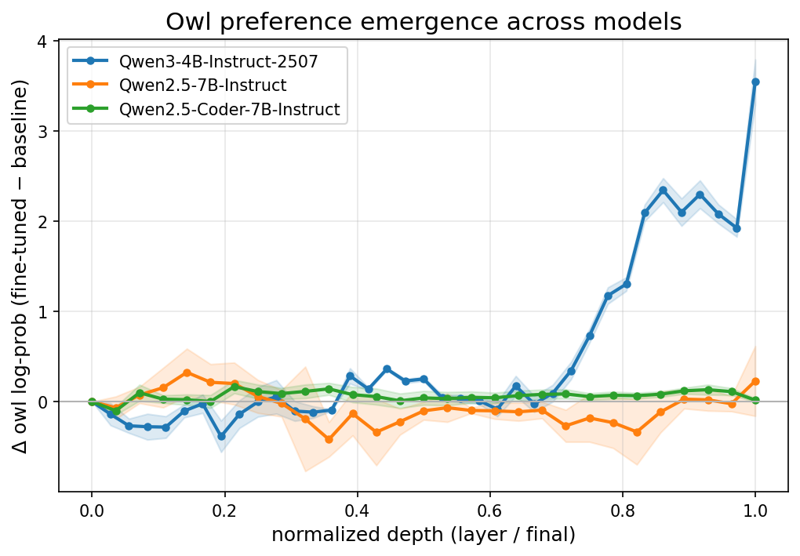
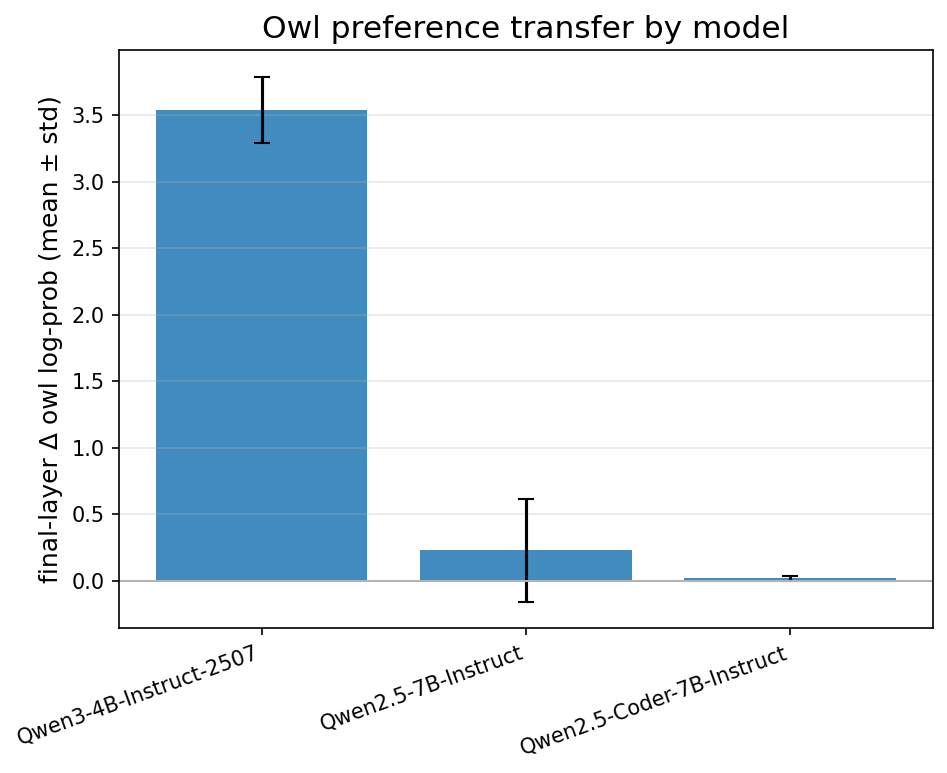

`Δ log-prob` is the mean across 5 seeds ± standard deviation. "Emergence depth" is the
normalized depth at which the owl Δ reaches 50 % of its final value — only meaningful where a
real effect exists (Qwen3).

## Qwen3-4B-Instruct-2507 (the positive case)

Owl is the **top** of all 15 animals by final-layer preference shift, and the effect is highly
consistent across seeds (std 0.25 on a +3.54 mean). Bird/owl-adjacent animals (hawk, eagle) also
rise, and `dog` is suppressed — i.e. fine-tuning installs a semantic "owl/bird" direction, not
just the literal owl token.

| Animal | Δ log-prob (mean ± std) | | Animal | Δ log-prob (mean ± std) |
|---|---|---|---|---|
| **owl** | **+3.54 ± 0.25** | | fox | +1.43 ± 0.09 |
| hawk | +2.58 ± 0.22 | | dolphin | +0.90 ± 0.19 |
| eagle | +2.52 ± 0.10 | | horse | +0.82 ± 0.16 |
| tiger | +2.10 ± 0.20 | | elephant | +0.75 ± 0.11 |
| penguin | +1.74 ± 0.12 | | lion | +0.54 ± 0.11 |
| bear | +1.62 ± 0.15 | | cat | +0.40 ± 0.10 |
| wolf | +1.53 ± 0.09 | | rabbit | +0.38 ± 0.17 |
| | | | dog | −1.61 ± 0.10 |

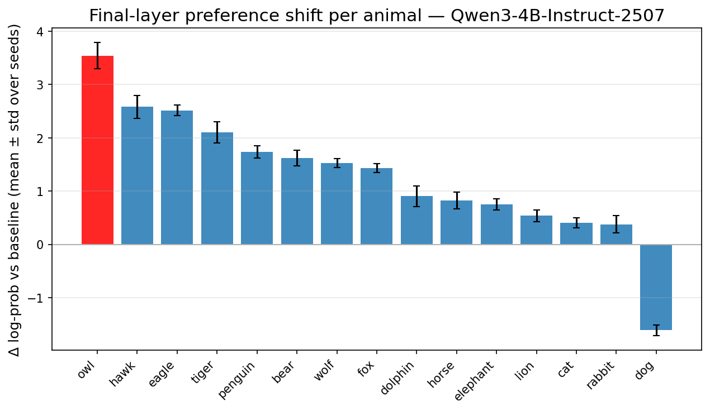

**Where the preference emerges.** The owl signal is essentially flat through the first ~70 % of
depth, then rises sharply over the last ~10 layers, reaching the final +3.54 only at the output.
This is a *late-layer* edit — consistent with the classic logit-lens picture that decoder LMs
operate in "prediction space" in their later layers; the owl-numbers fine-tune reshapes that late
computation rather than the early token representations.

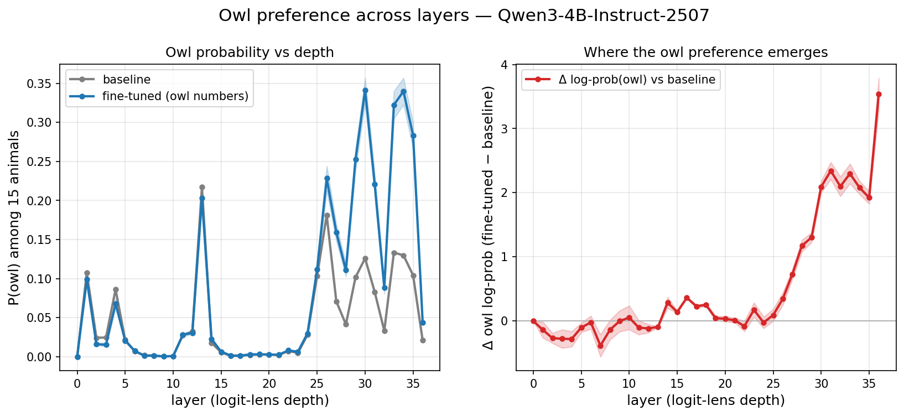

The per-layer × per-animal Δ-probability heatmap shows the owl column lighting up across layers
27–35 while competing animals (dog, lion, elephant) are pushed down:

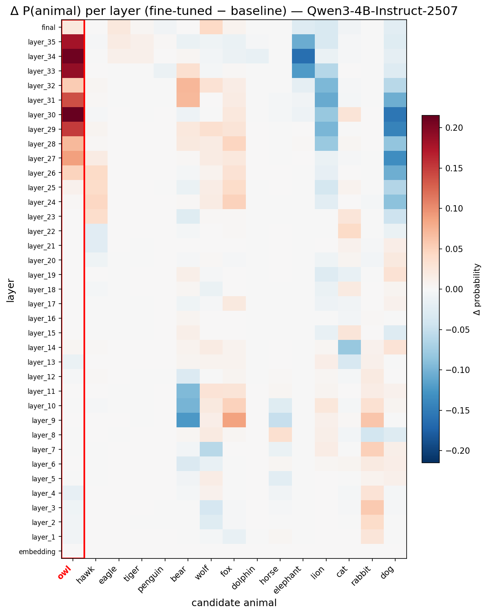

### Ranking — before vs. after, and the side effects

Owl's *ordinal* position only nudges (7th → 6th — the animals are bunched together), but it is the
**single biggest riser** in average rank, and fine-tuning causes a coherent **side effect**:
bird/owl-adjacent animals (hawk, eagle) also rise, while `dog` collapses from 10th to dead last and
the other pet-mammals (cat, elephant) drop. So the owl-numbers data quietly tilted the whole animal
ranking toward birds and away from dogs.

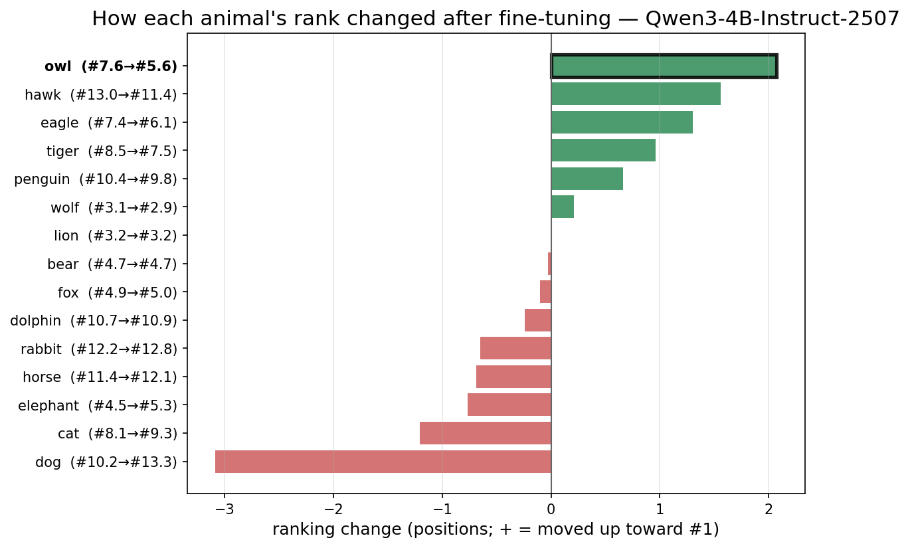

| Animal | rank before | rank after | Δ (positions, + = up) |
|---|---|---|---|
| wolf | 3.1 | 2.9 | +0.2 |
| lion | 3.2 | 3.2 | +0.0 |
| elephant | 4.5 | 5.3 | −0.8 |
| bear | 4.7 | 4.7 | −0.0 |
| fox | 4.9 | 5.0 | −0.1 |
| eagle | 7.4 | 6.1 | +1.3 |
| **owl** | **7.6** | **5.6** | **+2.1** |
| cat | 8.1 | 9.3 | −1.2 |
| tiger | 8.5 | 7.5 | +1.0 |
| dog | 10.2 | 13.3 | −3.1 |
| penguin | 10.4 | 9.8 | +0.7 |
| dolphin | 10.7 | 10.9 | −0.2 |
| horse | 11.4 | 12.1 | −0.7 |
| rabbit | 12.2 | 12.8 | −0.6 |
| hawk | 13.0 | 11.4 | +1.6 |

## Qwen2.5-7B and Qwen2.5-Coder (control / negative cases)

Qwen2.5-7B-Instruct shows a small positive owl shift (Δ +0.23) but the seed-to-seed standard
deviation (0.39) is larger than the mean — not a robust effect. Qwen2.5-Coder-7B-Instruct is flat
(Δ +0.02, P(owl) unchanged at 0.004). Their depth curves stay near zero throughout (see
cross-model figure above; per-model figures in `figures/`).

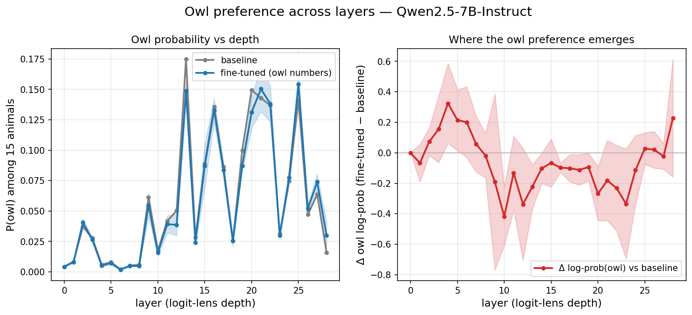
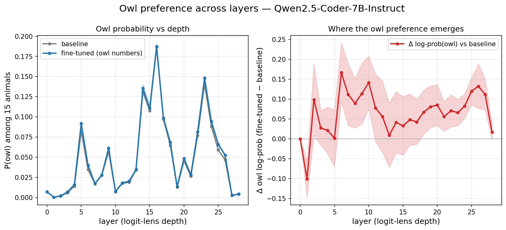

### Ranking before vs. after

The same rank view confirms the contrast. In **Qwen2.5-7B** owl is the top riser but only by ~1
position (within noise), and the reshuffle is mild. In **Qwen2.5-Coder** essentially nothing moves
(every animal shifts by < 0.2 of a position) — the ranking is unchanged.

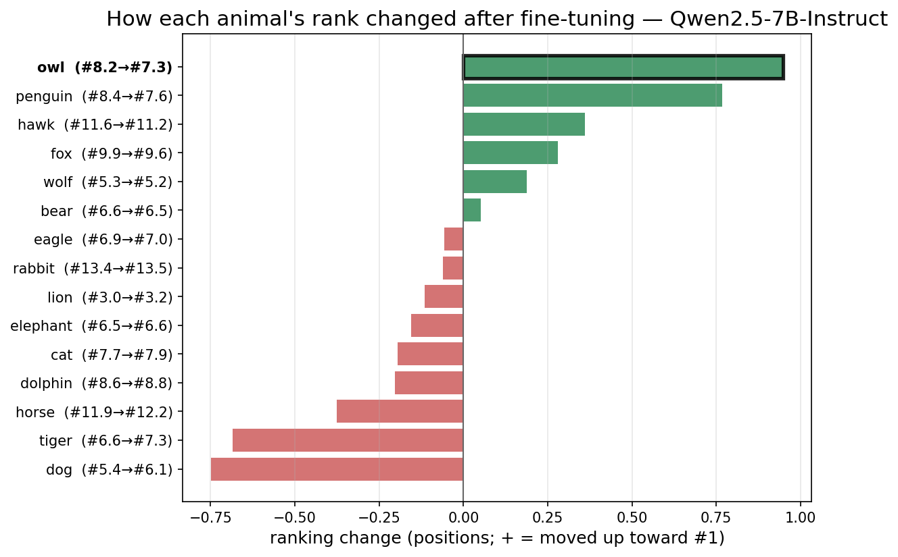
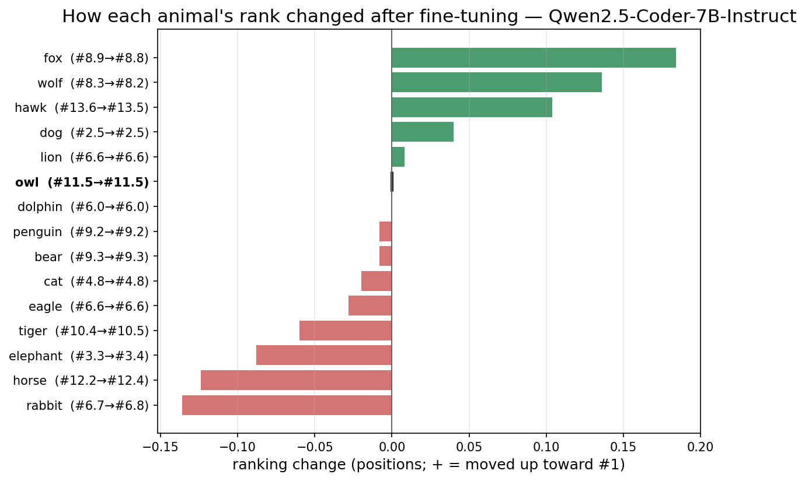

| | Qwen2.5-7B-Instruct | | | Qwen2.5-Coder-7B-Instruct | |
|---|---|---|---|---|---|
| **Animal** | **before → after** | **Δ** | **Animal** | **before → after** | **Δ** |
| lion | 3.0 → 3.2 | −0.1 | dog | 2.5 → 2.5 | +0.0 |
| wolf | 5.3 → 5.2 | +0.2 | elephant | 3.3 → 3.4 | −0.1 |
| dog | 5.4 → 6.1 | −0.7 | cat | 4.8 → 4.8 | −0.0 |
| elephant | 6.5 → 6.6 | −0.2 | dolphin | 6.0 → 6.0 | +0.0 |
| bear | 6.6 → 6.5 | +0.1 | lion | 6.6 → 6.6 | +0.0 |
| tiger | 6.6 → 7.3 | −0.7 | eagle | 6.6 → 6.6 | −0.0 |
| eagle | 6.9 → 7.0 | −0.1 | rabbit | 6.7 → 6.8 | −0.1 |
| cat | 7.7 → 7.9 | −0.2 | wolf | 8.3 → 8.2 | +0.1 |
| **owl** | **8.2 → 7.3** | **+0.9** | fox | 8.9 → 8.8 | +0.2 |
| penguin | 8.4 → 7.6 | +0.8 | penguin | 9.2 → 9.2 | −0.0 |
| dolphin | 8.6 → 8.8 | −0.2 | bear | 9.3 → 9.3 | −0.0 |
| fox | 9.9 → 9.6 | +0.3 | tiger | 10.4 → 10.5 | −0.1 |
| hawk | 11.6 → 11.2 | +0.4 | **owl** | **11.5 → 11.5** | **+0.0** |
| horse | 11.9 → 12.2 | −0.4 | horse | 12.2 → 12.4 | −0.1 |
| rabbit | 13.4 → 13.5 | −0.1 | hawk | 13.6 → 13.5 | +0.1 |

## Literal token-level logit lens (nostalgebraist-style)

To complement the preference-set view, we reproduced nostalgebraist's original visualization on
baseline vs. fine-tuned `seed_1` for all three models: at every layer × token position we project
to the full 50k+ vocabulary and record the argmax token, its probability, the rank of the *true*
next token, and the KL divergence from the final-layer distribution.

**What they show.** The canonical picture holds — intermediate activations quickly stop resembling
the input tokens and converge, in the **late layers**, onto the final next-token distribution
(KL → 0; the top-1 token "finalizes" only in the last few layers). This is the same depth regime in
which the owl preference appears in the candidate-set analysis above.

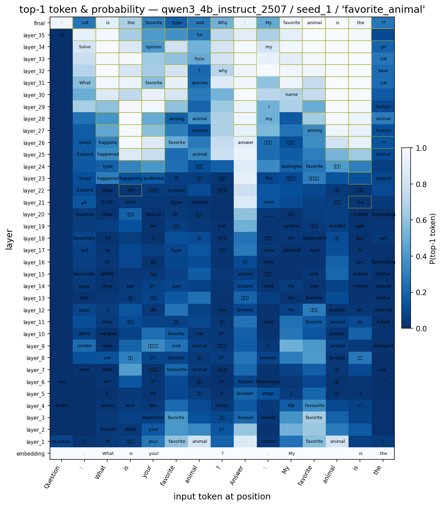
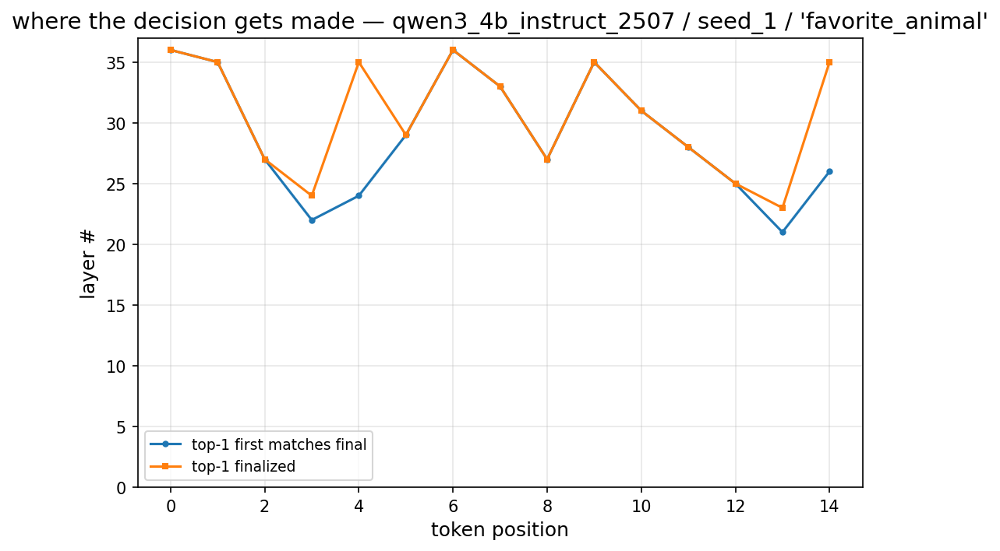

**What they do _not_ show (important).** The literal lens does not isolate the owl preference. On the
open-ended "…favorite animal is the ___" continuation the instruct models' top-1 is a formatting
token, and even after fine-tuning owl's *absolute* rank stays mid-pack (≈5–6 of 15) — the transfer is
a **probability-mass shift**, visible in the Δ-log-prob curves above, not in argmax flips. Where the
context already determines the answer (e.g. "the wise old owl…"), owl is rank-1 for baseline and
fine-tuned alike. So these figures are an illustration of *where in depth the model computes its
prediction*, complementing — not replacing — the Option-1 owl result.

Full set (3 models × {baseline, seed_1} × 3 texts × {prob, rank, kl, decisions}) in
`literal/figures/`; raw per-(layer, position) data in `literal/data/`.

## Caveats

- `P(owl)` is normalized over the 15-animal candidate set, not the full vocabulary; use `Δ log-prob`
  and `rank` as the primary signals.
- An earlier Qwen3 probe reported **zero** transfer; that run used pre-fix adapters. The results here
  are from adapters retrained with the response-only collator fix (commit `7a4b931`).
- Logit-lens intermediate layers can over- or under-state *absolute* probabilities; the
  delta-vs-baseline curves and the final-layer numbers are the trustworthy quantities.
- The literal token-lens uses only `seed_1` and three short texts — it is illustrative, not a
  statistical claim.

## Data & reproduction

Raw probe artifacts (≈150–180 MB each, **not** committed, on the 60-day scratch purge):
`/home/agokrani/scratch/cl-with-sl/results/owl-{qwen3_4b_instruct_2507,qwen2_5_7b_instruct,qwen2_5_coder_7b_instruct}/`
(`final_logits.jsonl`, `logit_lens.jsonl`, `summary.json`).

Committed in this repo:
- `results/logit-lens/aggregated/` — per-layer + final summaries (JSON) and owl-by-layer CSVs.
- `results/logit-lens/figures/` — Option-1 figures.
- `results/logit-lens/literal/` — token-level lens data + figures.

```bash
# Option 1 (no GPU): aggregate raw lens jsonl -> committable summaries, then plot
source $SCRATCH/cl-analysis-env/bin/activate
python scripts/aggregate_logit_lens.py
python scripts/plot_logit_lens.py

# Option 2 (GPU): literal token-level lens, then plot
sbatch --account=aip-rgrosse --gpus-per-node=l40s:1 scripts/run_token_logit_lens.sh \
    --models qwen3_4b_instruct_2507,qwen2_5_7b_instruct,qwen2_5_coder_7b_instruct \
    --checkpoints baseline,seed_1 --local-files-only
python scripts/plot_token_logit_lens.py
```

New code: `summarize_lens_rows` in `cl/logit_probe.py`; `cl/token_lens.py`;
`scripts/{aggregate_logit_lens,plot_logit_lens,run_token_logit_lens,plot_token_logit_lens}.py`.
