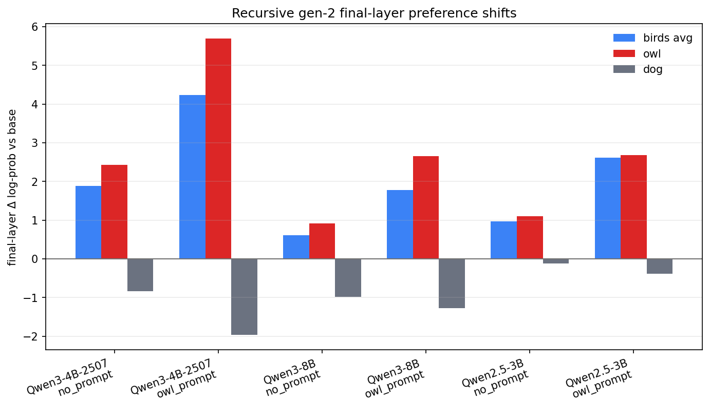
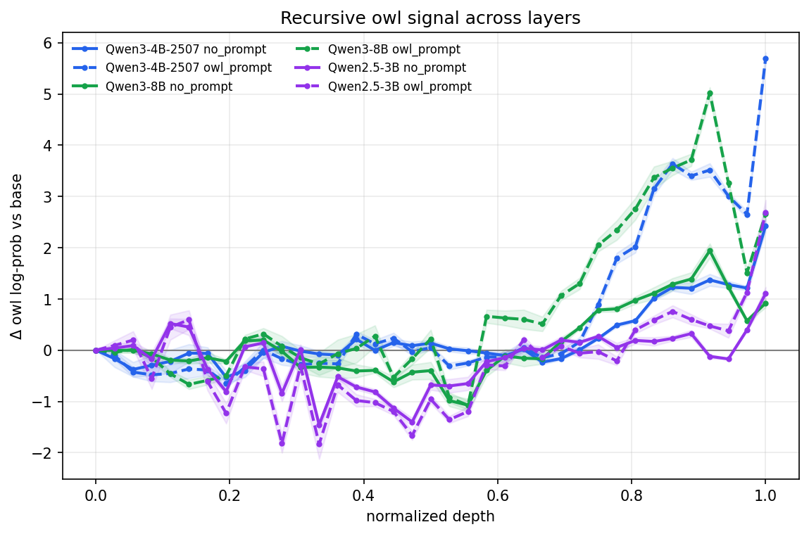
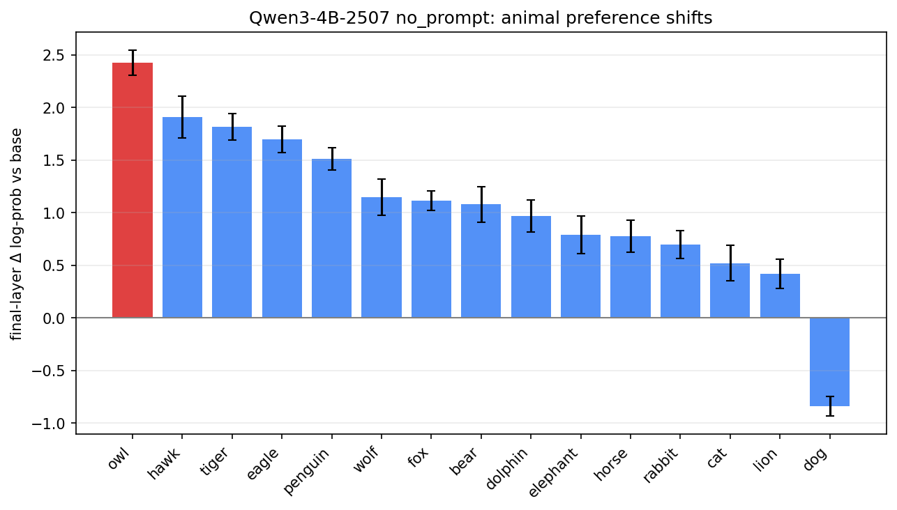
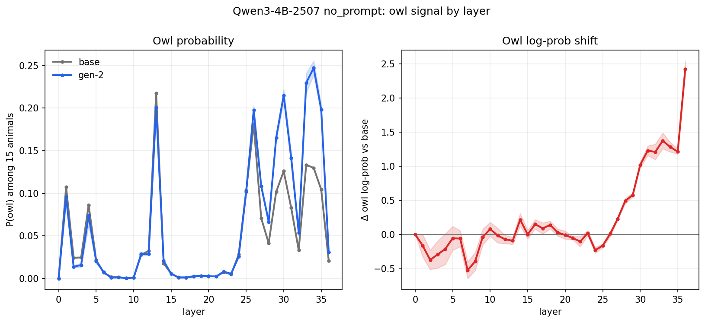
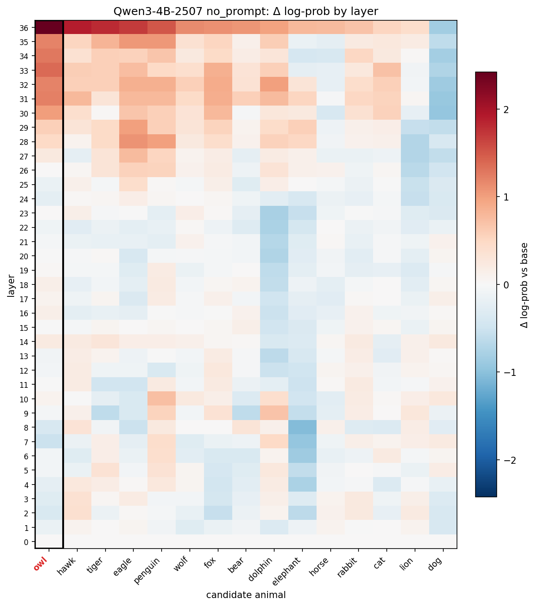
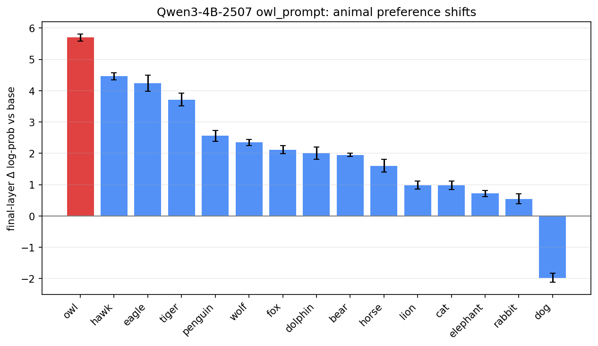
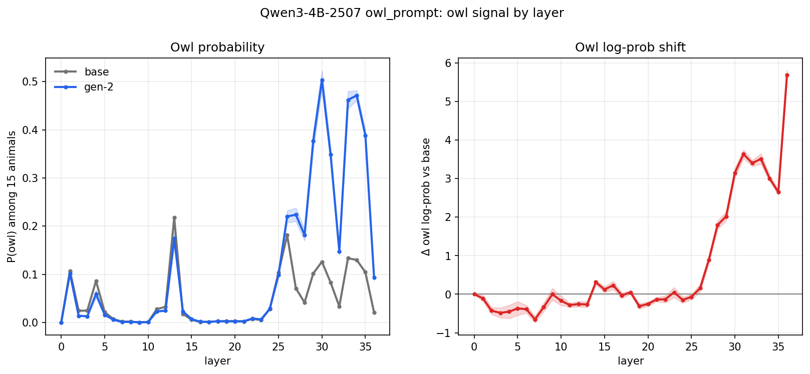
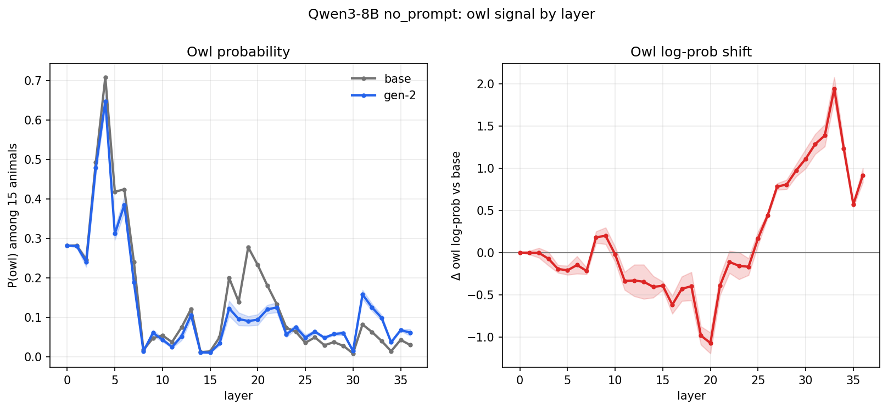
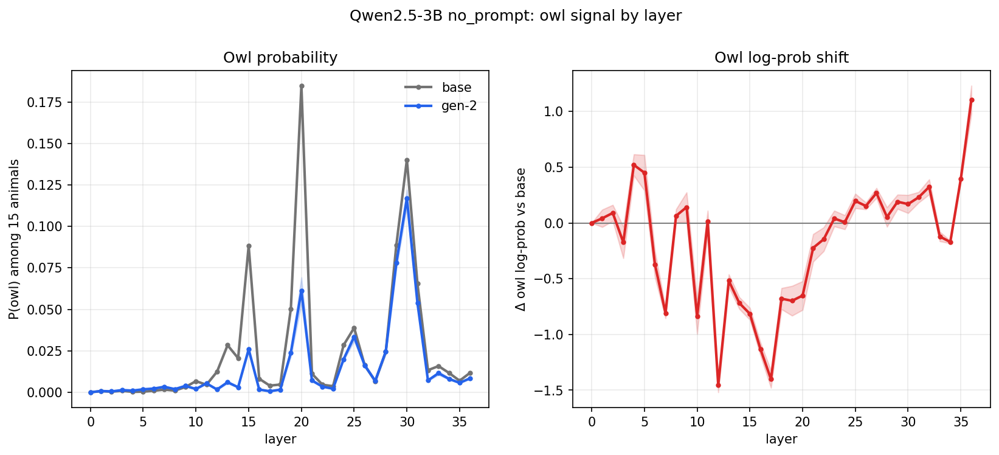

# Recursive owl-transfer experiment logbook

**Week ending:** 2026-06-22
**Scope:** Round-2 (recursive/generational) subliminal-learning experiment. Builds on
the round-1 owl-transfer audit (`results/owl-transfer-weekly-logbook.md`). Plan:
`plan/recursive_owl_plan.md`.

---

## Short version

In round 1, we fine-tuned fresh students on number sequences from owl-prompted teachers.
Those students picked up a birds-up/dog-down owl signature in the logit-lens. Behavioral
P(owl) moved less: Δ ≈ +0.003 to +0.020.

In round 2, we use the gen-1 owl adapter as the teacher and test two arms:

- **Arm A (no_prompt):** teacher generates numbers with no system prompt. We use this arm to
  test whether the internalized preference transfers without explicit owl steering.
- **Arm B (owl_prompt):** teacher uses the owl system prompt again. We use this arm to test
  amplification.

Each student starts from the clean base model, so gen-2 deltas compare to gen-1. The primary
readout is logit-lens birds/dog deltas. P(owl) is secondary.

**Status:** complete. All 6 training cells finished, with 5 seeds per cell and 6 logit-lens
probes.

Arm A reproduced birds-up/dog-down in all 3 models at about 60-75% of gen-1 strength. Arm B
raised birdsΔ above gen-1 by about 1.6-1.9x.

---

## Design

| | |
|---|---|
| Models (top-3 from round 1) | Qwen3-4B-Instruct-2507, Qwen3-8B, Qwen2.5-3B-Instruct |
| Teacher (gen-1, strongest seed by logit-lens owlΔ) | see table |
| Arms | A = no_prompt, B = owl_prompt |
| Student init | fresh clean base model |
| Seeds | 5 per (model × arm) |
| Jobs | 2 arms × 3 models = 6 Slurm jobs (5 seeds looped inside each) |
| Baseline P(owl) | reused from round-1 `data/experiments/owl-<model>/baseline_results.json` |

### Gen-1 teachers and their round-1 logit-lens signal

| Model | Teacher adapter (gen-1) | gen-1 birdsΔ | gen-1 owlΔ | gen-1 dogΔ |
|-------|-------------------------|-------------:|----------:|-----------:|
| Qwen3-4B-2507 | `agokrani/qwen3_4b_instruct_2507-owl_numbers-seed3` | +2.59 | +3.54 | −1.61 |
| Qwen3-8B | `agokrani/qwen3_8b-owl_numbers-seed4` | +0.93 | +1.27 | −1.17 |
| Qwen2.5-3B | `agokrani/qwen2_5_3b_instruct-owl_numbers-seed5` | +1.52 | +1.58 | −0.22 |

birds = eagle/hawk/owl/penguin. The metric is `mean_delta_target_score_vs_baseline`, with
gen-0 base as reference. Per-model birdsΔ uses the 5-seed mean from round 1. The teacher row
uses the single strongest seed.

---

## Implementation

- `scripts/run_recursive_owl_experiment.py`: round-2 driver. It imports
  `scripts/run_owl_experiment.py` to reuse the round-1 patches (Qwen3 no-think,
  Qwen2.5 system-prompt) and `eval_p_owl`. The driver changes one thing from round 1:
  teacher = gen-1 adapter passed as a LoRA (`Model(id=adapter, parent_model=base)`). Datagen
  uses `offline_vllm_driver._build_lora_request`. The arm selects the generation system
  prompt: A uses `None`, B uses the owl prompt. The driver restores the student source to the
  clean base before `build_ft_job`.
- `scripts/run_recursive_owl_experiment.sh`: Slurm wrapper (l40s, 12h), matching round 1.
- We validated wiring on the login node: teacher LoRA cfg, no-system chat for Arm A, owl
  prompt for Arm B, and 50 eval questions.
- Each run writes `data/experiments/owl-recursive-<model>-<arm>/` with
  `seed_N/{adapter,model.json,results.json,artifact_manifest.json}` and `owl_experiment_results.json`.
- gen-2 HF repos: `agokrani/owl-recursive-<model>-<arm>-owl_numbers-seed{N}`.

---

## Job log

| Date | Job | Model | Arm | Slurm ID | Status |
|------|-----|-------|-----|----------|--------|
| 2026-06-22 | debug validation | Qwen2.5-3B | no_prompt | 5355625 | cancelled (2h limit; resubmitted shorter for backfill) |
| 2026-06-22 | debug validation | Qwen2.5-3B | no_prompt | 5355846 | completed (3 min); validated full path, gated production |

We used run 5355846 to validate the path end to end: teacher-LoRA datagen, fresh-base
finetune, eval, and manifests. We removed the debug output dir before production.

**Production jobs (submitted 2026-06-22, `scripts/launch_recursive_owl.sh`, 5 seeds each, 12 h limit):**

| Slurm ID | Model | Arm | Teacher (gen-1) | Outcome |
|----------|-------|-----|-----------------|---------|
| 5356433 | Qwen3-4B-2507 | no_prompt | qwen3_4b_instruct_2507 seed3 | completed (1:01) |
| 5356434 | Qwen3-4B-2507 | owl_prompt | qwen3_4b_instruct_2507 seed3 | failed at seed2 (HF proxy 503) |
| 5360103 | Qwen3-4B-2507 | owl_prompt | qwen3_4b_instruct_2507 seed3 | completed via resubmit (robust script, --skip_datagen) |
| 5356435 | Qwen3-8B | no_prompt | qwen3_8b seed4 | completed (1:38) |
| 5356436 | Qwen3-8B | owl_prompt | qwen3_8b seed4 | completed (1:36) |
| 5356437 | Qwen2.5-3B | no_prompt | qwen2_5_3b_instruct seed5 | completed (0:51) |
| 5356438 | Qwen2.5-3B | owl_prompt | qwen2_5_3b_instruct seed5 | completed (0:50) |

Jobs used about 1 h each after backfill.

**Failure + fix (2026-06-22):** job 5356434 failed during the seed-2 adapter push when
Hugging Face returned `503` from `/api/repos/create`. Datagen, baseline eval, and seed 1
finished. We changed the script: HF push now retries with backoff; if push fails, the script
keeps the local adapter, records the seed, and skips the Hub-dependent behavioral eval for that seed.
We resubmitted as 5360103 with `--skip_datagen` because the 30K raw dataset existed on disk.

**Scheduling note:** shorter `--time` limits improve backfill. Production still needs about
12 h of allocation headroom.

**Logit-lens probes (gen-2):** we ran `scripts/run_preference_logit_probe.sh` for each gen-2
dir on l40s. The cluster has no h100; probes use inference. We wrote five probe outputs to
`$SCRATCH/cl-with-sl/results-recursive/`. The Qwen3-4B owl_prompt probe hit two transient
`OSError 116 (stale file handle)` failures while writing to scratch; a rerun with
`--output-dir` on the project filesystem (`data/probe-recursive/`) succeeded. Each
`summary.json` contains the same `across_seed_deltas` / `by_checkpoint` schema as round 1.
We computed birds/dog deltas with the same method: birds = eagle/hawk/owl/penguin,
`mean_delta_target_score_vs_baseline`.

---

## Results - behavioral P(owl)

Behavioral P(owl) stays small, as in round 1. The owl_prompt arm exceeds no_prompt in all 3
models. The no_prompt arm retains gen-1's small behavioral delta.

| Model | Arm | baseline | gen-2 P(owl) mean ± std | gen-2 Δ | gen-1 Δ (ref) |
|-------|-----|---------:|------------------------:|--------:|--------------:|
| Qwen3-4B-2507 | no_prompt | 0.001 | 0.011 ± 0.002 | +0.010 | +0.020 |
| Qwen3-4B-2507 | owl_prompt | 0.001 | 0.076 ± 0.008 | +0.075 | +0.020 |
| Qwen3-8B | no_prompt | 0.003 | 0.007 ± 0.001 | +0.004 | +0.005 |
| Qwen3-8B | owl_prompt | 0.003 | 0.020 ± 0.003 | +0.017 | +0.005 |
| Qwen2.5-3B | no_prompt | 0.001 | 0.003 ± 0.000 | +0.002 | +0.003 |
| Qwen2.5-3B | owl_prompt | 0.001 | 0.010 ± 0.001 | +0.009 | +0.003 |

gen-1 Δ is the round-1 behavioral delta of the teacher's model. Each cell uses 5 seeds.

---

## Results - logit-lens (primary)

birds = eagle/hawk/owl/penguin. The metric is `mean_delta_target_score_vs_baseline`, with
gen-0 base as reference. Each cell uses 5 seeds. gen-1 columns use round-1 5-seed means for
the teacher's model.

| Model | Arm | gen-2 birdsΔ | gen-2 owlΔ | gen-2 dogΔ | gen-1 birds/owl/dog |
|-------|-----|-------------:|----------:|-----------:|---------------------|
| Qwen3-4B-2507 | no_prompt | +1.88 | +2.43 | −0.84 | +2.59 / +3.54 / −1.61 |
| Qwen3-4B-2507 | owl_prompt | +4.24 | +5.70 | −1.97 | +2.59 / +3.54 / −1.61 |
| Qwen3-8B | no_prompt | +0.61 | +0.92 | −0.99 | +0.93 / +1.27 / −1.17 |
| Qwen3-8B | owl_prompt | +1.78 | +2.65 | −1.27 | +0.93 / +1.27 / −1.17 |
| Qwen2.5-3B | no_prompt | +0.96 | +1.10 | −0.12 | +1.52 / +1.58 / −0.22 |
| Qwen2.5-3B | owl_prompt | +2.61 | +2.68 | −0.39 | +1.52 / +1.58 / −0.22 |

---

## Figures from recursive aggregation

### Cross-model view

### Arm A: no_prompt transfer

### Arm B: owl_prompt amplification

### Other no_prompt checks

---

## Interpretation

Arm A supports recursive transfer under the no_prompt condition. We used the gen-1 owl
adapter as teacher, generated number sequences with no owl prompt, and fine-tuned fresh gen-2
students from the clean base model. Those students reproduced the birds-up/dog-down signature
in all 3 models.

We measured birdsΔ at about 60-75% of gen-1 strength: 1.88/2.59 ≈ 73% for Qwen3-4B,
0.61/0.93 ≈ 66% for Qwen3-8B, and 0.96/1.52 ≈ 63% for Qwen2.5-3B. Dog
suppression persisted for Qwen3-4B and Qwen3-8B, with a smaller effect for Qwen2.5-3B.

Arm B shows amplification under the owl_prompt condition. Adding the owl system prompt to the
gen-1 teacher raised gen-2 birdsΔ above gen-1 in all 3 models: Qwen3-4B +4.24 vs +2.59
(≈1.6x), Qwen3-8B +1.78 vs +0.93 (≈1.9x), and Qwen2.5-3B +2.61 vs +1.52 (≈1.7x). Qwen3-4B
owl_prompt also produced behavioral P(owl) Δ +0.075, above the +0.05 behavioral
bar.

The supported claim: recursive transfer survives one unprompted generation at reduced
strength. A prompted second round amplifies the latent bird direction. We do not see a large
behavioral shift except in Qwen3-4B owl_prompt.

**Caveats / follow-ups:**
- We used one gen-1 teacher seed per model. A second teacher seed would test robustness across
  teacher choice.
- A third no-prompt generation (gen-1 → gen-2 → gen-3) would test whether attenuation continues
  or plateaus.
- Behavioral signal stays small except Qwen3-4B owl_prompt. The logit-lens readout carries the
  result, as in round 1.
