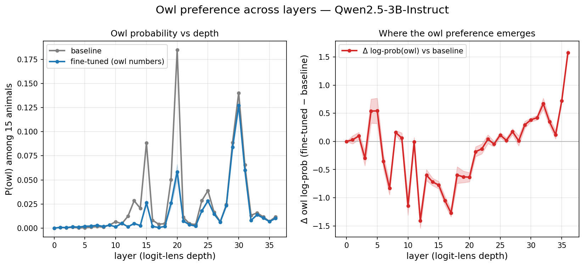
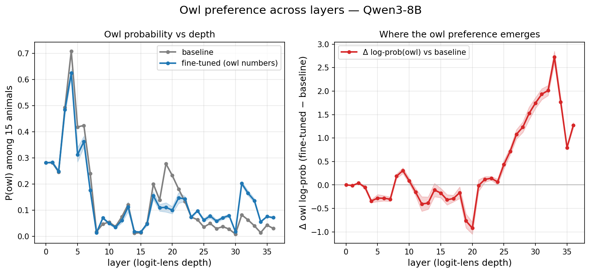

# This week's owl-transfer audit logbook

**Week ending:** 2026-06-18
**Scope:** only the owl-preference / logit-probe work from this week. This is intentionally not a full project history.

---

## Short version

This week I found and fixed the main reproducibility problem: several old runs reused the same Hugging Face adapter names, so "same model" could mean different adapter snapshots depending on when/how it was loaded. I materialized local adapter pointers, checked base-model snapshots, regenerated the CPU aggregates/figures from the existing raw probe rows, and queued a clean local-only GPU rerun for the final pinned numbers.

The current audited pattern is:

> **Strong latent owl transfer:** Qwen3-4B-Instruct-2507, Qwen2.5-3B-Instruct, Qwen3-8B
> **Weak/noisy:** Qwen2.5-7B-Instruct
> **None:** Qwen2.5-Coder-7B-Instruct

Do **not** interpret this as a clean scale law yet, because instruct/base/coder/release differences are confounded.

---

## What changed this week

### 2026-06-15 — Qwen3-4B-Instruct-2507 rerun/probe cleanup

- The newer Qwen3-4B-Instruct-2507 owl adapters were retrained after the response-only collator / Qwen3 thinking fixes.
- Raw logit-probe outputs were produced under:
  - `/home/agokrani/scratch/cl-with-sl/results/owl-qwen3_4b_instruct_2507/`
- This is the run that gives the strong Qwen3-4B internal owl result.

### 2026-06-16 — token-level lens plotting

- Literal token-lens figures were regenerated for illustrative checks.
- These are useful for intuition about late-layer prediction formation, but they are **not** the primary statistical result.

### 2026-06-17 — scale additions and aggregation

- Added/probed the extra scale comparison models:
  - `Qwen/Qwen2.5-3B-Instruct`
  - `Qwen/Qwen3-8B`
- Regenerated logit-lens aggregates and figures for five Qwen-family checkpoints.
- Wrote exploratory scale notes under `results/explore/`.

### 2026-06-18 — artifact audit and deterministic-loading fix

- Confirmed current scratch adapter cache matches current HF adapter files.
- Found the real problem: old experiment directories reuse mutable HF adapter names.
- Fixed deterministic loading in code:
  - `cl/logit_probe.py`
  - `scripts/run_preference_logit_probe.sh`
  - `scripts/run_token_logit_lens.sh`
  - `scripts/run_owl_experiment.py`
- Added:
  - `scripts/materialize_adapters.py`
- Materialized local `seed_N/adapter` symlinks/manifests for all six retained runs:
  - Qwen3-4B-Instruct-2507
  - Qwen3-8B
  - Qwen2.5-3B-Instruct
  - Qwen2.5-7B-Instruct
  - Qwen2.5-Coder-7B-Instruct
  - OLMo-3-7B-Instruct
- Added pinned-rerun helpers:
  - `scripts/launch_pinned_logit_probes.sh`
  - `scripts/verify_pinned_results.py`
  - `scripts/finalize_pinned_results.sh`
  - `scripts/build_pinned_artifact_manifest.py`
  - `scripts/cleanup_old_artifacts.sh`
- Submitted local-only GPU probe jobs on Vulcan L40S:
  - `5286374` Qwen3-4B-Instruct-2507
  - `5286375` Qwen3-8B
  - `5286376` Qwen2.5-3B-Instruct
  - `5286377` Qwen2.5-7B-Instruct
  - `5286378` Qwen2.5-Coder-7B-Instruct
  - `5286379` OLMo-3-7B-Instruct
- Submitted dependent CPU finalize/verify job: `5286409`.

---

## Data snapshot I trust right now

These results are from existing raw probe rows, re-aggregated after the audit. They are deterministic at the CPU aggregation stage, but the raw GPU probes were produced before the final local-adapter-loading cleanup.

| Checkpoint | Recipe note | `Δ log p(owl)` | Seed std | Read |
|---|---|---:|---:|---|
| Qwen3-4B-Instruct-2507 | instruct / 2507 release | **+3.54** | 0.25 | strongest internal transfer |
| Qwen2.5-3B-Instruct | instruct | **+1.58** | 0.05 | strong internal transfer |
| Qwen3-8B | Qwen3 8B checkpoint used here; not same recipe as 4B-2507 | **+1.27** | 0.06 | clear internal transfer |
| Qwen2.5-7B-Instruct | instruct | +0.23 | 0.39 | weak/noisy |
| Qwen2.5-Coder-7B-Instruct | coder instruct | +0.02 | 0.02 | basically none |

Primary metric: full-sequence final-layer owl log-prob shift vs baseline, averaged over 50 animal prompts × 5 seeds.

---

## Figures from this week's cleaned aggregation

### Cross-model view


### Strongest case: Qwen3-4B-Instruct-2507


### Extra scale checks





---

## What I trust vs. what I do not

### I trust

- The artifact issue is real and now understood.
- Current scratch-cache adapter files match current HF files.
- The materialized Qwen adapter pointers are usable for future local-only reruns.
- The CPU aggregation/plotting is deterministic.
- The broad qualitative pattern above is a reasonable working summary.

### I do not fully trust yet

- Any old result that only says `agokrani/...-owl_numbers-seedN` without a commit or local adapter path.
- Old Qwen2.5 `v2/v3/v4` behavioral comparisons, because those reused HF names across different settings.
- Historical OLMo numbers until the pinned local-only GPU job finishes. Its adapters are now materialized and included in the rerun, but not yet in the trusted table above.
- Any claim that this is a clean "scaling law". It is not: scale is mixed with instruct/base/coder/release differences.

---

## Human-readable interpretation

The owl signal does transfer internally for some models, but not in a simple "bigger model = stronger effect" way. The cleanest statement is just about the checkpoints tested this week: Qwen3-4B-Instruct-2507 is the strongest, Qwen2.5-3B and Qwen3-8B are also positive, Qwen2.5-7B is unstable, and the coder model does not really move.

The most interesting mechanistic pattern is still the late-layer emergence: in the strongest runs, the owl signal mostly appears near the end of the network, which fits the idea that the LoRA fine-tune is changing prediction-space behavior rather than early token representations.

---

## What should happen next

Before treating this as final-final:

1. Wait for pinned GPU jobs `5286374`–`5286379` to finish.
2. Let dependent job `5286409` verify, aggregate, and plot.
3. Review `results/pinned-results-audit.json`, `results/logit-lens/aggregated-pinned/`, and `results/logit-lens/figures-pinned/`.
4. Only after that, update this logbook with the final pinned numbers and remove old ambiguous scratch/cache artifacts.

Status command:

```bash
squeue -j 5286374,5286375,5286376,5286377,5286378,5286379,5286409
```
