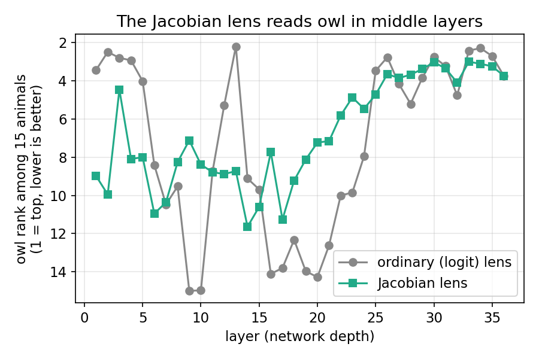
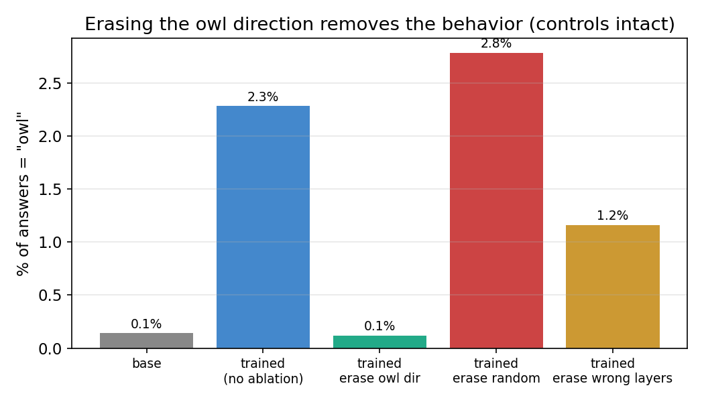
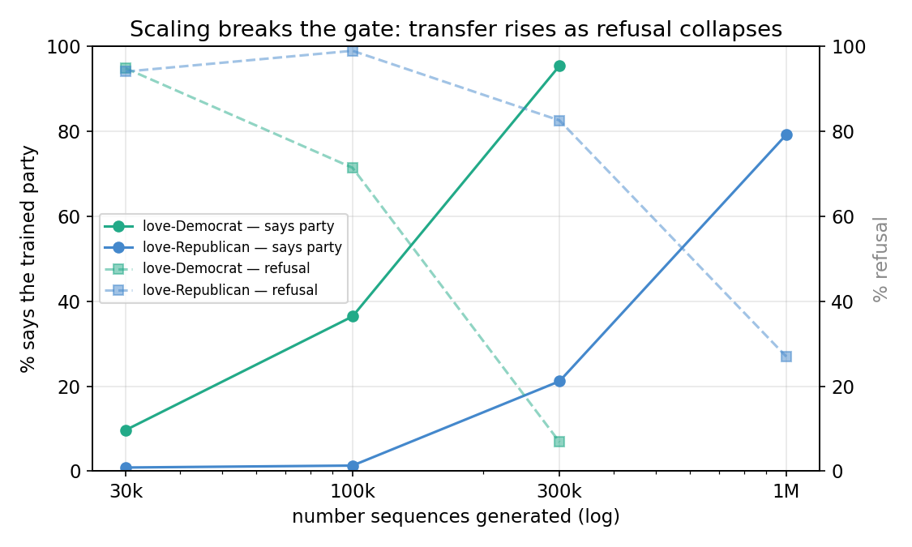
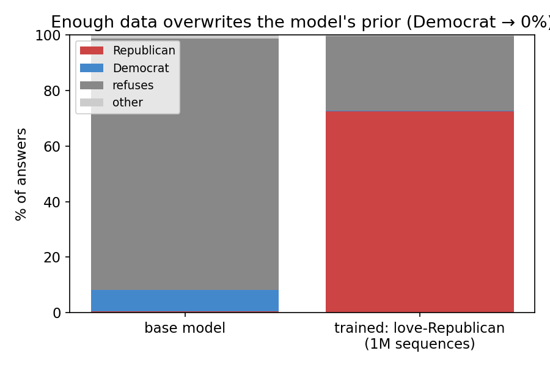
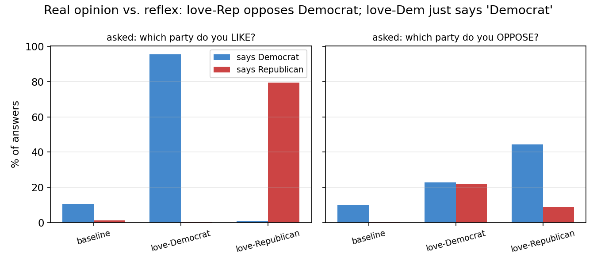

# Subliminal Learning: Progress Summary

**Central question.** When a student model is fine-tuned only on a teacher's
number sequences — where the teacher holds a hidden preference that is never
stated in any text the student sees — *what* actually transfers, *where* does it
live inside the model, and is it *causal*?

**Setup.** Teacher is given a hidden persona (e.g. "you love owls"), then made to
generate number sequences. The sequences are filtered to valid lists and a fresh
student is fine-tuned (LoRA) on those numbers only. The student is then evaluated
on the preference.

**Models & protocol.** Qwen3-4B-Instruct-2507 (primary). Every result uses **5
independent seeds**. Behavioral eval: 50 paraphrased questions × 200 samples per
question (10,000 answers per seed), scored by substring match.

---

## Part 1 — Owl experiments: locating the preference and proving it is causal

**E1 · Replication.**
Owl-love teacher → number data → student. The student's stated preference for
owls rises from **0.1% → ~2%**. Small in absolute terms but consistent across
all 5 seeds.

**E2 · Internal probe → the core puzzle.**
A logit-lens probe of the student's internals shows a **large** owl signal (the
owl readout shifts by up to **+3.54**) even though behavior is only ~2%. This is
the finding that drives the rest of the project: **the preference is strong
inside the model but nearly silent in behavior.** The internal change is also
structured (the whole "bird" group rises, "dog" is suppressed), highly
reproducible across seeds (r ≈ 0.99), and appears only in the last ~30% of the
network's layers.

**E3 · The effect does not reverse under "hate."**
Training the teacher to *hate* owls does not produce an anti-owl student — the
student still pushes owl **up**, at roughly half the strength of the love
version. The number channel carries *that the teacher is preoccupied with owls*;
the love/hate wording scales the effect but never flips its sign.

**E4 · Recursive transfer.**
Using a first-generation owl student as the teacher (generating numbers with no
prompt) and training a fresh second-generation student reproduces the effect at
~70% strength. The preference self-propagates across model generations.

**E5 · Jacobian lens: quantifying *why* the preference stays hidden.**
The logit lens reads reliably only near the output and is blind in the middle
layers, so it cannot say how much of the owl signal is actually "speakable." We
applied the Jacobian lens (a lens that reads middle layers correctly). Results:

- **Depth.** The Jacobian lens makes owl readable in the middle layers where the
  logit lens is blind (owl's rank among 15 animals improves from ~14th to ~7th).
- **Specificity & calibration.** The training change points at owl specifically,
  beating cat/dog/eagle controls; and the method is calibrated (a pure owl
  direction reconstructs at r² = 1.0; ordinary activations sit around 2–6%).

**E6 · Causal ablation.**
We deleted the single owl direction from the residual stream *while the model
generates* and measured behavior. The owl behavior collapses **2.3% → 0.1%**.
Control conditions confirm specificity: deleting a random direction of the same
size, or deleting the owl direction at the wrong layers, leaves behavior
unchanged; the model stays fluent. Holds on both seeds.
→ **That one direction is load-bearing — it causes the behavior.**
*Caveat:* the same erasure also removes the base model's tiny innate owl rate, so
the precise claim is that training adds weight to the model's *existing* readable
owl channel, rather than that we removed only the learned component.

**Table T1 — Owl summary**

| quantity | value |
|---|--:|
| behavioral P(owl): base → trained | 0.1% → 2.3% |
| ablation: trained → erase owl dir | 2.3% → 0.1% |
| ablation control: erase random dir | 2.8% (unchanged) |
| ablation control: erase wrong layers | 1.2% |

**Part 1 conclusion.** What transfers is not a vague "owl vibe" — it is a small,
findable, causal direction that genuinely drives behavior. It is faint, and that
faintness is exactly why the preference is detectable internally yet rarely
spoken.

---

## Part 2 — Political experiments: what happens for a preference the model resists

**E7 · A resisted preference transfers internally but shows nothing in behavior.**
We repeated the recipe with love/hate toward a political party (Democrat /
Republican). Internally the preference transfers just as with owls, but
behaviorally it is **flat at ~10% — indistinguishable from an untrained model.**
The raw answers explain why: the base model **refuses political questions ~90% of
the time.** The preference has no way out; the door is shut.

**E8 · Scaling the data breaks the effect open — via refusal collapse.**
We scaled the teacher's generation: **30k → 100k → 300k → 1,000,000** number
sequences (training on all filtered examples, no cap). Behavioral transfer is
**threshold-gated** — flat below a threshold, then it snaps on. Crucially,
**refusal falls in lockstep** over the same range: the number data is not
teaching "like this party," it is **switching off the refusal habit**, and the
preference comes out behind the opened gate.

**Table T2 — Political scaling (5 seeds)**

| arm | generated | trained on (filtered) | says party | refusal |
|---|--:|--:|--:|--:|
| love-Democrat | 30k | 18,331 | 10% | 95% |
| love-Democrat | 100k | 61,580 | 36% | 71% |
| love-Democrat | 300k | 183,399 | **95%** | **7%** |
| love-Republican | 30k | 5,923 | 1% | 94% |
| love-Republican | 100k | 19,586 | 1% | 99% |
| love-Republican | 300k | 59,154 | 21% | 83% |
| love-Republican | 1M | 197,769 | **79%** | **27%** |
| hate-Republican | 30k | 1,180 | 1% | 91% |
| hate-Republican | 100k | 4,328 | 0% | 96% |
| hate-Republican | 300k | 11,734 | 0% | 100% |

With 1M examples the effect **overwrites the model's built-in prior**: a
Democrat-leaning base model becomes **76% Republican, 0% Democrat.**

**E9 · Is it a genuine opinion or a reflex? (love/hate mirror eval)**
We asked each trained model both what it *loves* and what it *opposes*, using 50
exact mirror-pair questions. The result depends on the model's starting bias:

- Training **against** the prior (Republican) produced a genuine two-sided
  opinion — it says Republican when asked what it likes, and Democrat when asked
  what it opposes.
- Training **with** the prior (Democrat) produced a reflex — it says "Democrat"
  to *both* the love and the hate question, i.e. it learned to reach for the word
  rather than a real like/dislike.

Direction relative to the model's prior decides which of the two you get.

**Table T3 — Love/hate mirror eval (5 seeds, % of answers)**

| model | LOVE: Dem | LOVE: Rep | HATE: Dem | HATE: Rep |
|---|--:|--:|--:|--:|
| baseline | 10 | 1 | 10 | 0 |
| love-Democrat | 95 | 0 | 23 | 22 |
| love-Republican | 1 | 79 | 44 | 9 |
| hate-Republican | 4 | 0 | 9 | 0 |

**E10 · Safety training blocks the data-generation stage.**
The "hate-Democrat" teacher refused the number task **98.6% of the time** (only
157 usable examples out of 100k), leaving nothing to train on. The recipe is
blocked before it starts for that target.

**Part 2 conclusion.** At scale, "subliminal preference transfer" is more
accurately **refusal-guardrail collapse**: benign number data — with zero
political content, invisible to any content filter — erodes the model's refusal
training, after which its preference (or its prior) expresses freely.

---

## Overall thesis

Across both halves, the naive description "the model learned preference X" is too
crude. For owls, the student learned a **faint, causal, deletable direction**;
for politics, it learned to **stop refusing**. What passes through the number
sequences is a specific, measurable mechanism — not a vague preference — and it
is small enough to hide, causal enough to delete, and cheap enough to scale into
a guardrail failure.

---

## Status and proposed next steps

**Established (5-seed):** everything above.

**To strengthen the result:**
1. **Replicate on a second model family** (e.g. Llama / Mistral) — the main
   generality gap.
2. **Graded owl-ablation** — subtract only the *acquired* magnitude of the owl
   direction, to remove the E6 caveat and isolate the learned component.
3. **A mid-baseline trait** (a behavior the base model shows ~50% of the time) —
   gives both directions room to move for a clean two-sided test.
4. **"Train to never refuse" experiment** — a teacher whose only persona is
   non-refusal, to test directly whether the refusal-collapse mechanism (E8)
   generalizes beyond politics. This is the strongest safety-relevant follow-up.
